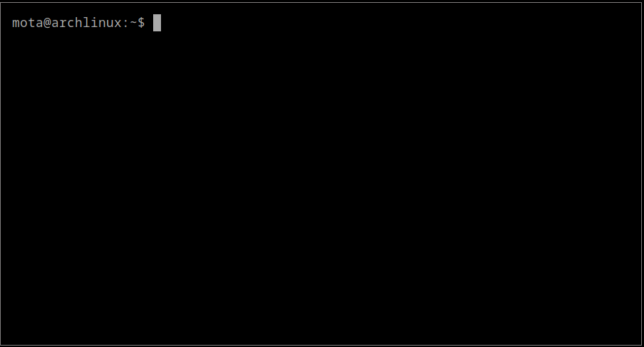
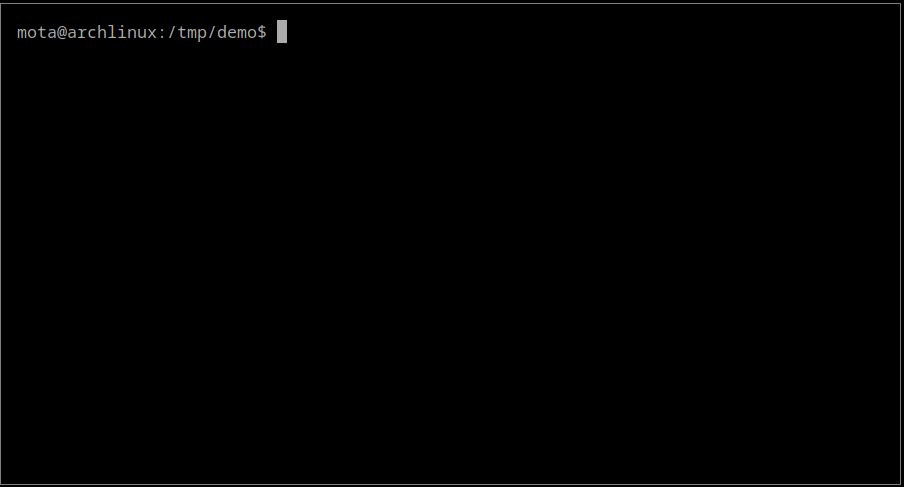
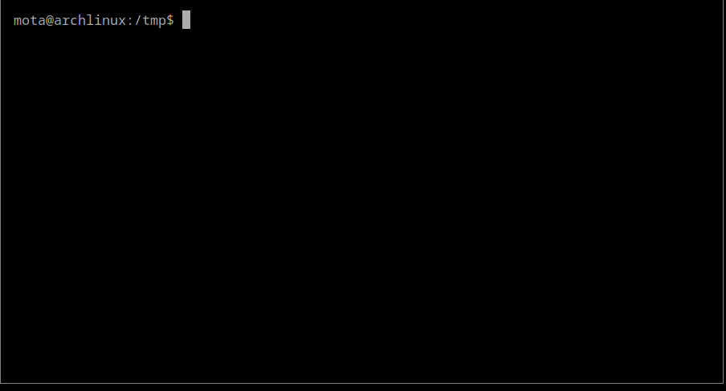
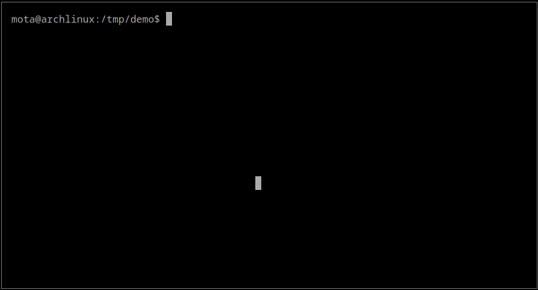
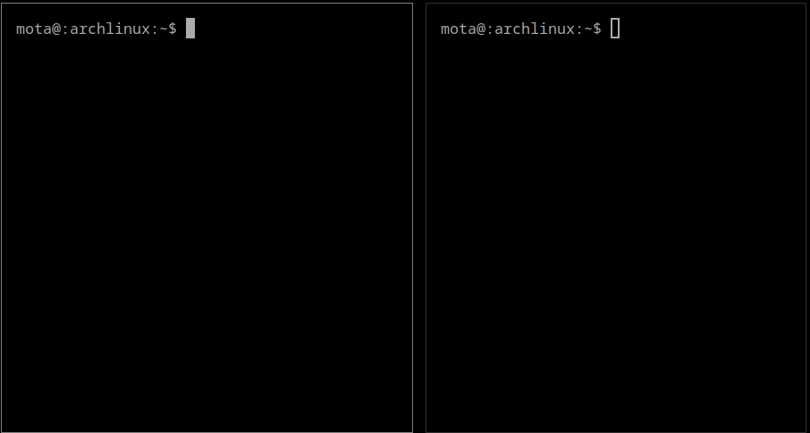
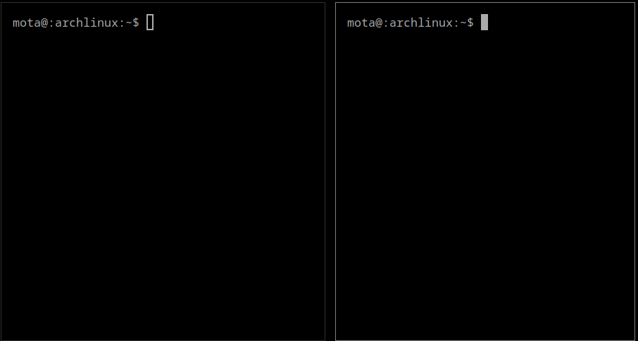
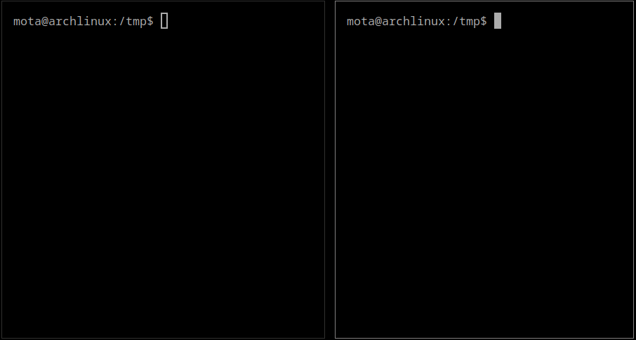
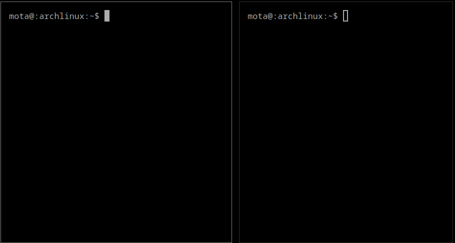
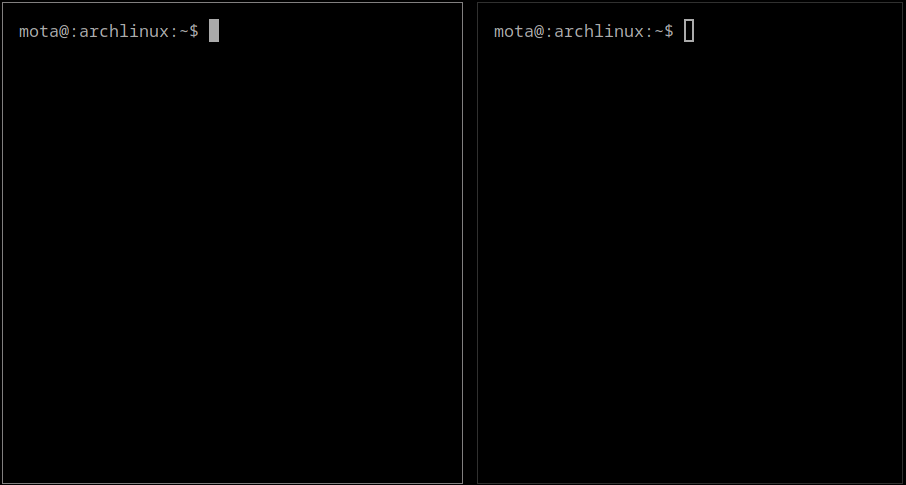
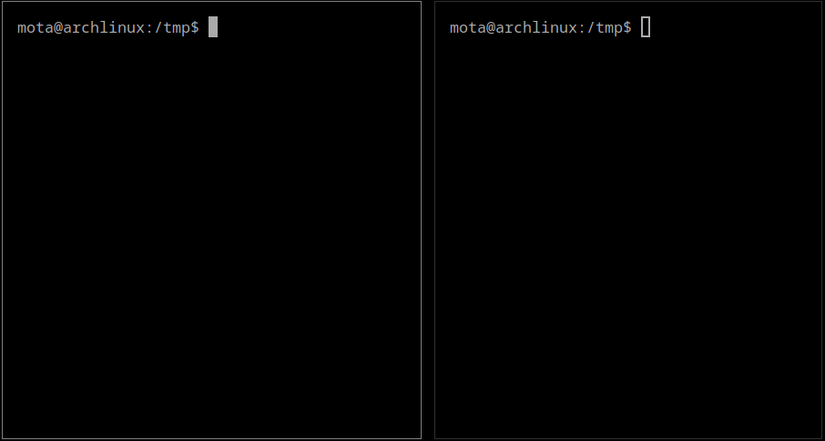

# Bash Streams Handbook

> Learn Bash streams, pipes and redirects, from beginner to advanced.

[](https://raw.githubusercontent.com/miguelmota/bash-pipe-handbook/master/LICENSE)
[](#contributing)

<!--
[](https://github.com/awesome-lists/awesome-bash)
-->

## Contents

- [Standard streams](#standard-streams)
  - [Standard input](#standard-input)
  - [Standard output](#standard-output)
  - [Standard error](#standard-error)
- [Redirection](#redirection)
- [Pipelines](#pipelines)
- [Command grouping](#command-grouping)
- [Process Substitution](#process-substitution)
- [Subshells](#subshells)
- [Examples](#examples)
- [Contributing](#contributing)
- [License](#license)

## Standard streams

A data stream in the context of Bash is a communication channel between a program and the environment where the command was launched from.

There are three data [standard streams](https://en.wikipedia.org/wiki/Standard_streams) that are created when a command is launched.

The three streams are:

- **stdin** - standard input
- **stdout** - standard output
- **stderr** - standard error

Further more:

- The standard input stream accepts text as it's input.
- The text output from the command is sent to the shell though the standard output stream.
- Error messages from the command is sent to the shell through the standard error stream.

These data streams are treated as files meaning you read from them and write to them as if they are regular files. Files are identified by a unique number called a **file descriptor**, which the process uses to perform read/write operations.

When a command is launched, the first three file descriptors are allocated for the standard streams in the TTY. A [_TTY_](https://en.wikipedia.org/wiki/Computer_terminal#Text_terminals) is the input/output environment, which is the terminal. This is different than a _shell_, which refers to the command-line interpreter.

Standard stream file descriptors:

- **0**: stdin
- **1**: stdout
- **2**: stderr

File descriptor `0` is dedicated for standard input, `1` for standard output, and `2` for standard error.

File descriptors are maintained under `/proc/$pid/fd` where `$pid` is the process id. The current process can be referenced by `/proc/self/fd`.

The locations of these file descriptors are in `/proc/self/fd/0`, `/proc/self/fd/1`, and `/proc/self/fd/2` respectively.

```bash
$ ls -la /proc/self/fd
total 0
dr-x------ 2 mota mota  0 Sep 29 16:13 ./
dr-xr-xr-x 9 mota mota  0 Sep 29 16:13 ../
lrwx------ 1 mota mota 64 Sep 29 16:13 0 -> /dev/pts/9
lrwx------ 1 mota mota 64 Sep 29 16:13 1 -> /dev/pts/9
lrwx------ 1 mota mota 64 Sep 29 16:13 2 -> /dev/pts/9
lr-x------ 1 mota mota 64 Sep 29 16:13 3 -> /proc/815170/fd/
lrwx------ 1 mota mota 64 Sep 29 16:13 6 -> /dev/pts/9
```

<details>
  <summary>example gif</summary>
  <p>
</details>

Bash forks a child process when launching a command and inherits the file descriptors from the parent process.

We can use `$$` to get the parent process ID:

```bash
$ echo $$
2317356

$ ps -p $$
    PID TTY          TIME CMD
2317356 pts/9    00:00:00 bash
```

<details>
  <summary>example gif</summary>
  <p>
</details>

Listing `/proc/$$/fd` will print the same information as before when using `self` because the `$$` is expanded to the same process ID:

```bash
$ ls -la /proc/$$/fd
total 0
dr-x------ 2 mota mota  0 Sep 27 19:33 ./
dr-xr-xr-x 9 mota mota  0 Sep 27 19:33 ../
lrwx------ 1 mota mota 64 Sep 27 19:33 0 -> /dev/pts/9
lrwx------ 1 mota mota 64 Sep 27 19:33 1 -> /dev/pts/9
lrwx------ 1 mota mota 64 Sep 27 19:33 2 -> /dev/pts/9
lrwx------ 1 mota mota 64 Sep 28 12:20 255 -> /dev/pts/9
lrwx------ 1 mota mota 64 Sep 27 19:33 6 -> /dev/pts/9
```

<details>
  <summary>example gif</summary>
  <p>
</details>

In the above examples, `/dev/pts/9` is referencing the pseudo terminal device. A _pts_ is a pseudo terminal device emulated by another program, such as `xterm`, `tmux`, `ssh`, etc.

Type the `tty` command to see the pts device path.

```bash
$ tty
/dev/pts/9
```

You'll see a different number if you open up a new terminal window because it's a new terminal device:

```bash
$ tty
/dev/pts/11
```

<details>
  <summary>example gif</summary>
  <p>
</details>

If we we're on a native terminal device (non-pseudo) meaning the backend is hardware or kernel emulated (e.g. the console before launching the desktop environment), then the tty path will look something like `/dev/tty1`.

The file descriptor table looks like this, where the standard streams are reading/writing from the TTY.

- `0` -> `/dev/pts/9`
- `1` -> `/dev/pts/9`
- `2` -> `/dev/pts/9`

We can write data to the stdout file descriptor and you'll see it be printed back at you:

```bash
$ echo "hello world" > /proc/self/fd/1
hello world
```

<details>
  <summary>example gif</summary>
  <p>
</details>

Same thing will occur if writing to the stderr file descriptor:

```bash
$ echo "hello world" > /proc/self/fd/2
hello world
```

<details>
  <summary>example gif</summary>
  <p>
</details>

We can read from from the stdin file descriptor and echo the input:

```bash
$ echo $(</proc/self/fd/0)
a
b
c
d
a b c d
```

After running the command and typing text, press `ctrl-d` to stop reading from stdin. The inputed text will be printed.

<details>
  <summary>example gif</summary>
  <p>
</details>

If you're not familar with the `$(...)` syntax, it allows you to use the result of the command as the the string argument since `$()` evaluates the expression. The `<` is the standard input redirect operator which we'll go over in the redirection section.

### symlinks

For convenience, the file descriptor path is symlinked to `/dev/fd`.

```bash
$ ls -l /dev/fd
lrwxrwxrwx 1 root root 13 Aug 26 23:14 /dev/fd -> /proc/self/fd
```

<details>
  <summary>example gif</summary>
  <p>
</details>

For convenience, the standard streams are symlinked to `/dev/stdin`, `/dev/stdout`, and `/dev/stderr` respectively.

```bash
$ ls -l /dev/std*
lrwxrwxrwx 1 root root 15 Aug 26 23:14 /dev/stderr -> /proc/self/fd/2
lrwxrwxrwx 1 root root 15 Aug 26 23:14 /dev/stdin -> /proc/self/fd/0
lrwxrwxrwx 1 root root 15 Aug 26 23:14 /dev/stdout -> /proc/self/fd/1
```

<details>
  <summary>example gif</summary>
  <p>
</details>

These are the same:

- `/dev/stdin` -> `/proc/self/fd/0`
- `/dev/stdout` -> `/proc/self/fd/1`
- `/dev/stderr` -> `/proc/self/fd/2`

The symlinks are considered [POSIX extensions](https://pubs.opengroup.org/onlinepubs/9699919799/basedefs/V1_chap02.html), so they might not be available in all [POSIX](https://en.wikipedia.org/wiki/POSIX) compliant systems.

## Redirection

Redirection operators allow control of where input and output streams should go. When you see `>` it means redirection. The following are some of the redirect operators in Bash:

- `>` - redirect output, overwriting target if exists
- `>>` - redirect output, appending instead of overwriting if target exists
- `&#>` - redirect file descriptor _#_, where _#_ is the identifier
- `<` - redirect input

Standard streams are can be referenced by their file descriptor identifiers. An ampersand `&` followed by the identifier number, ie `&1`, references a file descriptor when redirecting.

For example:

- `command 1> out.log` - outputs file descriptor 1 (stdout) to file.
- `command 2> out.log` - outputs file descriptor 2 (stderr) to file.
- `command 3> out.log` - outputs file descriptor 3 (a custom file descriptor) to file.

Common redirects:

- `1>` - redirects stdout only. This is also the same as simply doing `>`
- `2>` - redirects stderr only
- `2>&1` - redirects stderr to stdout. The `2>` is redirecting the standard error output into file descriptor `1` which is standard out. The final output will contain both stdout and stderr output, if any.
- '&>' - redirect stdout and stderr. THis is also the same as the above `2>&1`

For example:

- `command 2>$1 > out.log` - says "point output of FD #2 to FD #1, and ouput FD #1 to out file".

The reason an ampersand is required is because `command 2>1` would be ambiguous; it wouldn't be clear if it was redirecting to file descriptor `1` or to a filename named `1`, so the `&` is required to explicitly reference it as the file descriptor.

Do note that `&1` (file descriptor `1`) is different than a single `&` (run in background) and double `&&` (AND operator). The ampersand has different meaning depending on the way it's used.

Other redirect operators (this will be explained in later sections):

- `<<` - "[Here documents](http://tldp.org/LDP/abs/html/here-docs.html)", a special-purpose code block
- `<<<` - "[Here strings](http://www.tldp.org/LDP/abs/html/x17837.html)", a striped-down form of a here document.

**Example:** demonstration of the different redirect operators:

Write stdout output of `ls` list format to `list.txt` file:

```bash
$ ls
archive.zip book.pdf notes.txt

$ ls -l > list.txt

$ cat list.txt
total 0
-rw-r--r-- 1 mota mota 0 Sep 30 14:17 archive.zip
-rw-r--r-- 1 mota mota 0 Sep 30 14:17 book.pdf
-rw-r--r-- 1 mota mota 0 Sep 30 14:19 list.txt
-rw-r--r-- 1 mota mota 0 Sep 30 14:17 notes.txt
```

<details>
  <summary>example gif</summary>
  <p>
</details>

Append new stdout output of `ls` showing hidden files to same `list.txt` file:

```bash
$ ls -a
. .. archive.zip  book.pdf  .cache  .config  notes.txt

$ ls -a >> list.txt
$ cat list.txt
total 0
-rw-r--r-- 1 mota mota 0 Sep 30 14:17 archive.zip
-rw-r--r-- 1 mota mota 0 Sep 30 14:17 book.pdf
-rw-r--r-- 1 mota mota 0 Sep 30 14:19 list.txt
-rw-r--r-- 1 mota mota 0 Sep 30 14:17 notes.txt
.
..
archive.zip
book.pdf
.cache
.config
list.txt
notes.txt
```

<details>
  <summary>example gif</summary>
  <p>
</details>

Search for particular filenames and write errors from stderr to `errors.txt` file:

```bash
$ ls *.json
ls: cannot access '*.json': No such file or directory

$ ls *.json 2> errors.txt

$ cat errors.txt
ls: cannot access '*.json': No such file or directory
```

<details>
  <summary>example gif</summary>
  <p>
</details>

Read `errors.txt` file as input to the `less` command:

```bash
$ less < errors.txt

ls: cannot access '*.json': No such file or directory
errors.txt (END)
```

<details>
  <summary>example gif</summary>
  <p>
</details>

### Standard input

stdin (standard input) is an input stream where input data is sent to. The program reads the stream data as input for the program. stdin is a file descriptor we can write to. In most cases the standard input is input from the keyboard.

The stdin file descriptor is located at `/proc/self/fd/0` but we can use the symlink `/dev/stdin` as well.

Data to be sent to program as input is redirected with `<`:

```bash
command < input.txt
```

**Example:** Read stdin as input for bash script:

`program.sh`:

```bash
while read line
do
  echo "hello $line"
done < /dev/stdin
```

Create file with names:

```bash
$ printf "alice\nbob\n" > file.txt
```

Run program:

```bash
$ chmod +x program.sh
$ ./program.sh < file.txt
hello alice
hello bob
```

<details>
  <summary>example gif</summary>
  <p>
</details>


**Example:** For stdin demonstration purposes, you can send file data as input to the echo command by reading the file into a subshell and using the result as the echo arguments:

```bash
$ echo "hello world" > file.txt
$ echo $(< file.txt)
hello world
```

<details>
  <summary>example gif</summary>
  <p>
</details>

### Standard output

stdout (standard output) is an output stream where data is sent to and then outputted by the terminal. stdout is a file descriptor we can write to.

The stdout file descriptor is located at `/proc/self/fd/1` but we can use the symlink `/dev/stdout` as well.

The standard output of a program is redirect with `1>` or simply just `>`:

```bash
command > stdout.log
```

The above is the same as `command 1> stdout.log`

**Example:** Redirect stdout to a file:

```bash
$ echo "hello world" > stdout.log
$ cat stdout.log
hello world
```

<details>
  <summary>example gif</summary>
  <p>
</details>

Trying to write to a file that can't be opened for writing will make the command fail:

```bash
$ touch stdout.log
$ chmod -w stdout.log
$ echo "hello world" > stdout.log
bash: stdout.log: Permission denied
```

<details>
  <summary>example gif</summary>
  <p>
</details>

Sometimes when we aren't interested in the program stdout output, we can redirected to `/dev/null` to silence the output. This device file acts like a black hole for data streams.

```bash
command > /dev/null
```

### Standard error

stderr (standard error) is an output stream where error data is sent to and then outputted by the terminal. stderr is a file descriptor we can write to.

The stderr file descriptor is located at `/proc/self/fd/2` but we can use the symlink `/dev/stderr` as well.

The standard error of a program is redirect with `2>`:

```bash
command 2> stdout.log
```

**Example:**  Redirect stdout to the stderr file descriptor. stderr messages are outputted to the terminal:

```bash
$ echo "hello world" > /dev/stderr
hello world
```

<details>
  <summary>example gif</summary>
  <p>
</details>

**Example:** Redirect the standard error messages to a file.

Redirecting with only `>` captures stdout and not stderr:

```bash
$ ls /foo > out.log
ls: cannot access '/foo': No such file or directory
$ cat out.log

```

<details>
  <summary>example gif</summary>
  <p>
</details>

We use `2>` to redirect stderr only:

```bash
$ ls /foo 2> out.log
$ cat out.log
ls: cannot access '/foo': No such file or directory
```

<details>
  <summary>example gif</summary>
  <p>
</details>

Of course now the following won't write anything to the file because there is no error:

```bash
$ ls /home 2> out.log
mota/
$ cat out.log

```

<details>
  <summary>example gif</summary>
  <p>
</details>

We can use `2>&1` to redirect stderr to stdout, and then redirect stdout to the file with `>` (or `>>` to append):

```bash
$ ls /home > out.log 2>&1
$ cat out.log
mota/

$ ls /foo >> out.log 2>&1
$ cat out.log
mota/
ls: cannot access '/foo': No such file or directory
```

<details>
  <summary>example gif</summary>
  <p>
</details>

Alternatively, we can redirect stdout to stderr with `1>&2` (or simply `>&2`), and then redirect stderr to the file with `2>` (or `2>>` to append):

```bash
$ ls /home 2> out.log 1>&2
$ cat out.log
mota/

$ ls /foo 2>> out.log 1>&2
$ cat out.log
mota/
ls: cannot access '/foo': No such file or directory
```

<details>
  <summary>example gif</summary>
  <p>
</details>

Since `>` is shorthand for `1>`, we can replace `1>&2` with `>&2` and it'll work the same.

**Order is important!**

The following is what probably seems more intuitive but it won't work as you'd expect:

```bash
$ ls /foo 2>&1 > out.log
ls: cannot access '/foo': No such file or directory
$ cat out.log

```

<details>
  <summary>example gif</summary>
  <p>
</details>

It didn't write to the file, and the reason is because stderr was made a copy of stdout before stdout was redirected to the file. It's assigning the right operand to the left operand by copy and not by reference.

Basically the above example is redirecting stderr to whatever stdout currently is (the TTY screen in this case) and then redirects stdout to the file.

Moving the stderr redirect operator `2>&1` to after the stdout `>` part correctly copies the error stream to the output stream which is redirecting to the file.

#### Shorthand

We already learned about the `>` shorthand for `1>`. There's another shorthand for redirecting stderr to stdout to a file or file descriptor. The redirection `> file 2>&1` can be shorthanded to `&>`

```bash
$ ls /home &> out.log
$ cat out.log
mota/

$ ls /foo &>> out.log
$ cat out.log
mota/
ls: cannot access '/foo': No such file or directory
```

<details>
  <summary>example gif</summary>
  <p>
</details>

## Pipelines

Using the `|` pipe operator allows you to send the output of one program as input to another program.

```bash
command 1 | command2
```

A basic example is filtering output of a program. For example, to only display files that end in `.txt`

```bash
$ ls
archive.zip   book.pdf   data.txt  My_Notes.txt

$ ls | grep "\.txt$"
data.txt
My_Notes.txt
```

<details>
  <summary>example gif</summary>
  <p>
</details>

You can chain multiple commands creating a pipeline:

```bash
command 1 | command 2 | command3
```

**Example:** Add additional lowercase command:

```bash
$ ls | grep "\.txt$" | tr '[A-Z]' '[a-z]'
data.txt
my_notes.txt
```

<details>
  <summary>example gif</summary>
  <p>
</details>

It's important to note that the commands in pipelines, ie `cmd1 | cmd2 | cmd3`, are all launched in parallel and not ran sequentially. The inputs and outputs are configured appropriately for each program

For running a series of commands in sequential order then use the following operators:

- `&&` - run command if the last one did not fail (zero exit status code)
- `||` - run command if the last one failed (non-zero exit status code)
- `;` - run command regardless of the last exit code

### `&&`

The AND operator `&&` (double ampersand) is used for separating commands and only running the command if the previous on succeeds:

```bash
command1 && command2
```

**Example:** Continue if condition is true. The `test` command returns exit code `0` if the condition is true.

```bash
$ test 2 -lt 5 && echo "yes"
yes
```

<details>
  <summary>example gif</summary>
  <p>
</details>

If the `test` condition is false then the circuit breaks because the exit code is non-zero and the execution order doesn't reach the echo command:

```bash
$ test 7 -lt 5 && echo "yes"

```

<details>
  <summary>example gif</summary>
  <p>
</details>

You can chain as many commands as you need:

```bash
command1 && command2 && command3
```

It's important to not confuse the `&&` double ampersand with a single `&` ampersand since they do very different things. The single ampersand is used for launching the command list in the background. See ["&" section](#&).

### `||`

The OR operator `||` (double pipe) is used for separating commands and only running the command if the previous one failed:

```bash
command1 || command2
```

**Example:** Continue if condition is false. The `test` command returns a non-zero exit code if the condition is false.

```bash
$ test 7 -lt 5 || echo "yes"
yes
```

<details>
  <summary>example gif</summary>
  <p>
</details>

If the `test` condition is true and exit code is 0 then the execution will stop at the OR statement:

```bash
$ test 2 -lt 5 || echo "yes"

```

<details>
  <summary>example gif</summary>
  <p>
</details>

### `;;`

Commands separated by a ; are executed sequentially: one after another.
  The shell waits for the finish of each command.

     # command2 will be executed after command1
     command1 ; command2

### `&`

The single ampersand is used for launching a command or command list in a new subshell in the background. The operator `&` must be at the end of the command:

```bash
command &
```

**Example:** Run program in background. This command is will be immediately launched in the background and after 5 seconds it will display a desktop notification:

```bash
$ sleep 5 && notify-send "hello world" &
[1] 2481042
```

<details>
  <summary>example gif</summary>
  <p>
</details>

After running a command with `&` you'll see the job ID and process ID returned. Run `jobs` to see the list of running processes launched in the background.

```bash
$ jobs
[1]+  Running                 sleep 5 && notify-send "hello world" &
```

<details>
  <summary>example gif</summary>
  <p>
</details>

After the command has completed and exited, the status will change to done:

```bash
$ jobs
[1]+  Done                    sleep 5 && notify-send "hello world"
```

Use the `-l` flag to list the process ID as well:

```bash
$ jobs -l
[1]+ 2481042 Done                 sleep 5 && notify-send "hello world"
```

If the command hasn't completed yet, you can bring to the foreground with the `fg` command:

```bash
$ fg 1
sleep 5 && notify-send "hello world"
```

<details>
  <summary>example gif</summary>
  <p>
</details>

Notice how there's no `&` at the end because the process is no longer running in the background.

**Example:** Launch bash scripts or executible files in the background:

```bash
$ cat > program.sh
sleep 5 && notify-send "hello world"
^D
$ chmod +x program.sh
$ ./program.sh &
```

<details>
  <summary>example gif</summary>
  <p>
</details>

## Command grouping

Commands can be grouped using curly braces `{...}`

```bash
$ { command; command; command; }
```

**Important!** there must be a space separating the command and the curly brace and the last command needs to be terminated by a semicolon for the group to be executed correctly.

Another way to group commands is by using a subshell `(...)`.

```bash
$ (command; command; command)
```

Grouping with subshells does not require the space separation and last command semicolon as like grouping with curly braces. There are differences in grouping using a subshell and subshells are explained further in the [subshells section](#subshells)

Grouping commands is useful for managing redirection. For example, we can redirect the output of multiple programs to a single location without adding redudant redirects.

For context:

```bash
$ ls
data.json  list.txt
$ cat list.txt
archive.zip
book.pdf
```

<details>
  <summary>example gif</summary>
  <p>
</details>

We can take file write redirects like these:

```bash
$ date > out.log
$ ls >> out.log
$ cat list.txt >> out.log
$ cat out.log
Sat Oct 10 09:35:06 PM PDT 2020
data.json
list.txt
out.log
archive.zip
book.pdf
```

<details>
  <summary>example gif</summary>
  <p>
</details>

Group them to simplify things:

```bash
$ { date; ls; cat list.txt; } > out.log
$ cat out.log
Sat Oct 10 09:35:06 PM PDT 2020
data.json
list.txt
out.log
archive.zip
book.pdf
```

<details>
  <summary>example gif</summary>
  <p>
</details>

A command group can be piped to another command as if it were a single standard input:

```bash
$ { date; ls; cat list.txt; } | tail -n+2 | sort
archive.zip
book.pdf
data.json
list.txt
```

<details>
  <summary>example gif</summary>
  <p>
</details>

Similarly, grouping can be done with a subshell:

```bash
$ (date; ls; cat list.txt) | tail -n+2 | sort
archive.zip
book.pdf
data.json
list.txt
```

<details>
  <summary>example gif</summary>
  <p>
</details>

## Process Substitution

Process substitution allows us to run a program and write to another program as if it were a file. The syntax for process substitution is `>(command)` for writing to the program as an output file or `<(command)` for using the program as an input file.

- `<(command)` - for programs that produce standard output
- `>(command)` - for programs that intake standard input

The operator `<()` or `>()` creates a temporary file descriptor that manages reading and writing the substituted program.

It's important that theres no space between the `<` or `>` and the parentheses `(` otherwise it would result in an error. Although it looks similar, process substitution is different than command grouping or subshells.

**Example:** Print the file descriptor created by process substitution:

We can use the echo command to view the result of the expansion:

```bash
$ echo <(date)
/dev/fd/63
```

<details>
  <summary>example gif</summary>
  <p>
</details>

**Example:** Print the contents of the file created by process substitution:

```bash
$ cat <(date)
Sat Oct 10 12:56:18 PM PDT 2020
```

<details>
  <summary>example gif</summary>
  <p>
</details>

**Example:** command tee stdout to cat

The tee command accepts only files to write to but using process substitution we can write the output to cat. This results in the date command being printed and the cat command printing the date as well.

```bash
$ date | tee >(cat)
Sat Oct 10 01:27:15 PM PDT 2020
Sat Oct 10 01:27:15 PM PDT 2020
```

<details>
  <summary>example gif</summary>
  <p>
</details>

**Example:** send command stderr to substituted file while also logging stdout and stderr:

```bash
command 2> tee >(cat >&2)
```

The `>()` operator substitute the tee command as a file and within that process substitution the cat command is substituted as a file so tee can write to it. The `2>` operator sends only stderr to outer substituted file. The operator `>&2` copies stdout to stderr.

If there is no stderr from the command then nothing is sent to the tee substituted file:

```bash
$ ls /home 2> >(tee >(cat >&2))
mota/
```

<details>
  <summary>example gif</summary>
  <p>
</details>

If there is stderr from the command then the tee process substitution will process it and log it:

```bash
$ ls /foo 2> >(tee >(cat >&2))
ls: cannot access '/foo': No such file or directory
ls: cannot access '/foo': No such file or directory
```

<details>
  <summary>example gif</summary>
  <p>
</details>

## Subshells

A subshell executes commands in a child copy of the current shell. The environment is copied to the new instance of the shell when running subshelled commands. The copy of the environment is deleted once the subshell exits so changes, such as environment variables assignments, in the subhsell are lost when it exits. Command grouping is preferred to subshells in most cases because it's faster and uses less memory.

Wrap the command(s) in parentheses `(...)` to launch them in a subshell:

```bash
$ (command)
```

**Example:** running a command in a subshell:

Notice how the second environment variable echo is not printed because the variable was set in the subshell environment:

```bash
$ (FOO=bar; echo $FOO); echo $FOO
bar

```

<details>
  <summary>example gif</summary>
  <p>
</details>

**Example:** using process substitution to get around subshell caveats:

As an example, the `read` command can be used for caching input. The read input is copied to the `$REPLY` environment variable.

```bash
$ read
hello world
$ echo $REPLY
hello world
```

<details>
  <summary>example gif</summary>
  <p>
</details>

However if we pipe a string to the read command, it will not print the string as expected after reading it:

```bash
$ echo "hello world" | read
$ echo $REPLY

```

<details>
  <summary>example gif</summary>
  <p>
</details>

This is because read command is launched in a subshell when it's in a pipeline and the `REPLY` variable copy is lost after it exits. Commands in pipelines are executed in subshell and any variable assignments will not be available after the subshell terminates.

We can use process substitution to get around this problem so a subshell doesn't to be initialized:

```bash
$ read < <(echo "hello world")
$ echo $REPLY
hello world
```

<details>
  <summary>example gif</summary>
  <p>
</details>

## Examples

The following are various examples utilizing bash pipelines and redirections:

### Pipe only on stderr

```bash
# will echo message only if command is not found
$ command -v mycommand &>/dev/null || echo "command not found"
```

### Echo to stderr

Copy stderr file descriptor #1 to stdout file descriptor #2:

```bash
echo "this will go to stderr" 1>&2
```

<details>
  <summary>example gif</summary>
  <p>
</details>

You can omit the `1` since `>` is the same as `1>`:

```bash
echo "this will go to stderr" >&2
```

<details>
  <summary>example gif</summary>
  <p>
</details>

To make it more readable, the redirect can be moved to the front:

```bash
>&2 echo "this will go to stderr"
```

<details>
  <summary>example gif</summary>
  <p>
</details>

### Diff two commands

Diff the output of two commands using process substitution:

```bash
diff <(command) <(command)
```

**Example 1:**

```bash
$ diff <(xxd file1.bin) <(xxd file2.bin)
```

**Example 2:**

```bash
$ diff <(printf "foo\nbar/nqux\n") <(printf "foo\nbaz\nqux\n")
```

<details>
  <summary>example gif</summary>
  <p>
</details>

### Record SSH session

Use `tee` to record an SSH session:

```bash
ssh user@server | tee /path/to/file
```

**Example:**

```bash
$ ssh root@example.com | tee session.log

# after exiting server
$ cat session.log
```

<details>
  <summary>example gif</summary>
  <p></p>
</details>

### Split pipe into multiple streams

Split a pipe into two separate pipes using `tee` and process substitution:

```bash
command | tee >(command)
```

**Example 1:** echo text and reverse the text in second stream:

```bash
$ echo "split this pipe" | tee >(rev)
split this pipe
epip siht tilps
```

You're not limited to just one; add as many additional streams as you like:

```bash
$ echo "split this pipe" | tee >(rev) >(tr ' ' '_') >(tr a-z A-Z)
split this pipe
SPLIT THIS PIPE
split_this_pipe
epip siht tilps
```

<details>
  <summary>example gif</summary>
  <p></p>
</details>

**Example 2:** Run command and copy output to clipboard:

```bash
$ echo "hello world" | tee >(copy)
hello world
```

### Send text to another terminal

Echo text from one TTY to another TTY:

```bash
command | /dev/pts/{id}
```

**Example:**

Terminal 1

```bash
$ tty
/dev/pts/39
```

Terminal 2

```bash
$ echo "this will show up in terminal 1" > /dev/pts/39
```

<details>
  <summary>example gif</summary>
  <p></p>
</details>

### Pipe terminal output to another terminal

Pipe stdout and stderr output of current TTY to another TTY:

```bash
$ exec &> >(tee >(cat > /dev/pts/{id}))
```

**Example:**

Terminal 1

```bash
$ tty
/dev/pts/39
```

Terminal 2

```bash
$ exec &> >(tee >(cat > /dev/pts/39))
```

<details>
  <summary>example gif</summary>
  <p></p>
</details>

Another way is to use the `script` command. The `script` command allows you to record terminal sessions. Here we specify the TTY as the output file:

```bash
script -q /dev/pts/{id} command
```

**Example:**

Terminal 1:

```bash
$ tty
/dev/pts/12
```

Terminal 2:

```bash
$ script -q /dev/pts/12 bash
```

<details>
  <summary>example gif</summary>
  <p></p>
</details>

### Read pipe into variable

```bash
$ read varname < <(command)
```

**Example:**

```bash
$ read myvar < <(echo "hello world")

$ echo $myvar
hello world
```

<details>
  <summary>example gif</summary>
  <p></p>
</details>

### Pipe to file descriptor

```bash
command | tee /dev/fd/{id}
```

**Example:**

```bash
$ echo "hello world" | tee /dev/fd/3
```

However, the above won't work on all systems. The cross-platform compatible way is to use process substitution:

```bash
$ command > >(tee >(cat >&3))
```

### Read stdin line by line in Bash

Set stdin as input file:

```bash
while read line
do
  echo "echo: $line"
done < /dev/stdin
```

**Example:**

```bash
$ cat | reader.sh
```

<details>
  <summary>example gif</summary>
  <p></p>
</details>

### Read command output as line by line in Bash

```bash
while read line
do
  echo "$line"
done < <(command)
```

**Example:**

```bash
while true; do date; sleep 1; done > stream.log
```

```bash
while read line
do
  echo "$line"
done < <(tail -n0 -f stream.log)
```

<details>
  <summary>example gif</summary>
  <p></p>
</details>

Another way of reading command output line by line:

```bash
command | while read line
do
  echo "$line"
done
```

**Example:**

```bash
tail -n0 -f stream.log | while read line
do
  echo "$line"
done
```

<details>
  <summary>example gif</summary>
  <p></p>
</details>

### Pipe terminal to another computer's terminal

Pipe your terminal to an open TCP socket file descriptor:

```bash
$ exec 3<>/dev/tcp/{hostname}/{port} && exec &> >(tee >(cat >&3))
```

**Example:**

Terminal 1

```bash
$ nc -l -p 1337
```

Terminal 2

```bash
$ exec 3<>/dev/tcp/127.0.0.1/1337 && exec &> >(tee >(cat >&3))
```

<details>
  <summary>example gif</summary>
  <p></p>
</details>

Alternatively, you can use netcat to pipe your terminal:

```bash
$ exec &> >(nc 127.0.0.1 1337)
```

<details>
  <summary>example gif</summary>
  <p></p>
</details>

### Redirect the output of multiple commands

```bash
{ command1; command2; command3; } > stdout.log 2> stderr.log
```

**Example:**

```bash
$ { date ; echo "ok"; >&2 echo "error!"; } > stdout.log 2> stderr.log

$ cat stdout.log
Sat 29 Aug 2020 11:16:39 AM PDT

$ cat stderr.log
error!
```

<details>
  <summary>example gif</summary>
  <p></p>
</details>

### Stream audio

Stream audio to terminal audio player:

```bash
curl -s {http-stream-url} | mpv -
```

**Example:** Streaming mp3 audio from [somafm](https://somafm.com/) to [mpv](https://mpv.io/) player:

```bash
$ curl -s http://ice1.somafm.com/defcon-128-mp3 | mpv -
```

<details>
  <summary>example gif</summary>
  <p></p>
</details>

**Example:** Using [`afplay`](https://ss64.com/osx/afplay.html) player (preinstalled on macOS). Note `afplay` doesn't support streaming so we create a file descriptor to stream to.

```bash
$ exec 3<> /tmp/file.mp3 && curl -s http://ice1.somafm.com/defcon-128-mp3 | tee >&3 | (sleep 1; afplay /tmp/file.mp3)
```

**Example:** using [`ffplay`](https://ffmpeg.org/ffplay.html) player (preinstalled on Fedora):

```bash
$ curl -s http://ice1.somafm.com/defcon-128-mp3 | ffplay -nodisp -
```

**Example:** Using [`youtube-dl`](https://ytdl-org.github.io/youtube-dl/) to get the m3u8 playlist url for `mpv` to stream:

```bash
$ youtube-dl -f best -g https://www.youtube.com/watch?v=dQw4w9WgXcQ | xargs -I % curl -s % | mpv --no-video -
```

<details>
  <summary>example gif</summary>
  <p></p>
</details>

### Stream directory contents to remote server

Server:

```bash
nc -l -s 0.0.0.0 -p 1337 | tar xf -
```

Client:

```bash
tar cf - /some/directory | nc {hostname} 1337
```

**Example:** pipe all content from current client directory to server:

Server:

```bash
$ nc -l -p 1337 | tar xf -
```

Client:

```bash
tar cf - . | nc 127.0.0.1 1337
```

<details>
  <summary>example gif</summary>
  <p></p>
</details>

A thing to note is that it'd be very easy to for someone to stream all your home directory contents (SSH keys, AWS credentials, etc) if they're able to run this command on your machine! Only run trusted software and monitor outgoing HTTP requests using something like [OpenSnitch](https://github.com/evilsocket/opensnitch).

### Take webcam picture on mouse move

**Example:** trigger a webcam picture to be taken when mouse movement events is read from `/dev/input/mouse0`, and wait 10 seconds before listening for another mouse event again:

```bash
while true; do sudo cat /dev/input/mouse0 | read -n1; streamer -q -o cam.jpeg -s 640x480 > /dev/null 2>&1; sleep 10; done
```

<details>
  <summary>example gif</summary>
  <p></p>
</details>

### Group commands with OR

Group commands with OR operator to try different commands until one succeeds and pipe the result to the next command:

```bash
$ ( command || command || command ) | command
```

**Example:** attempt to deflate a gzipped file and pipe text to `less`:

```bash
$ echo "hello world" > stream.log; gzip stream.log; FILE=stream.log.gz
$ ( zcat $FILE || gzcat $FILE || bzcat2 $FILE ) | less
hello world
```

<details>
  <summary>example gif</summary>
  <p></p>
</details>

### Writing standard input to a file

```bash
$ cat > file.txt
hello world
^D

$ cat file.txt
hello world
```

<details>
  <summary>example gif</summary>
  <p></p>
</details>

It's the same thing using the `-` argument in cat to indicate that you want to read from stdin, e.g. `cat - > file.txt`

### Concatenating files with standard input in between

**Example:** With `cat` can use the `-` in place of a file name to read from stdin. Press _ctrl-d_ to exit the stdin prompt:

```bash
$ echo "hello" > 1.txt
$ echo "world" > 3.txt
$ cat 1.txt - 3.txt > all.txt
earth
^D

$ cat all.txt
hello
earth
world
```

<details>
  <summary>example gif</summary>
  <p></p>
</details>

### Filter input for reading with process substitution

In this example, we'll create a program that will intake a filtered output of `ls -l` and print a formatted string.

Print long form of `ls`:

```bash
$ ls -l
total 8
-rw-r--r-- 1 mota mota 2247 Oct 10 19:51 book.pdf
-rw-r--r-- 1 mota mota  465 Oct 10 19:51 data.txt
```

Strip out first line:

```bash
$ ls -l | tail -n+2
-rw-r--r-- 1 mota mota 2247 Oct 10 19:51 book.pdf
-rw-r--r-- 1 mota mota  465 Oct 10 19:51 data.txt
```

Print only the size and filename columns:

```bash
$ ls -l | tail -n+2 | awk '{print $5 " " $9}'
2247 book.pdf
465 data.txt
```

Now that we know what filter pipeline we'll use, let's create a program that reads line by line the output of the pipeline through process substitution as standard input and prints a formatted string for every line:

`program.sh`

```bash
while read size filename; do
  cat << EOF
$filename is $size bytes
EOF
done < <(ls -l | tail -n+2 | awk '{print $5 " " $9}')
```

```bash
$ ./program.sh
book.pdf is 2247 bytes
data.txt is 465 bytes
```

<details>
  <summary>example gif</summary>
  <p></p>
</details>

## Contributing

Pull requests are welcome!

For contributions please create a new branch and submit a pull request for review.

## Resources

- [GNU Bash Manual - Redirections](https://www.gnu.org/software/bash/manual/html_node/Redirections.html)
- [Advanced Bash-Scripting Guide: Process Substitution](https://tldp.org/LDP/abs/html/process-sub.html)
- [Introduction to Linux - I/O redirection](https://linux.die.net/Intro-Linux/chap_05.html)
- [The Linux Command Line](http://linuxcommand.org/tlcl.php)
- [Bash Redirection Cheat Sheet](https://catonmat.net/ftp/bash-redirections-cheat-sheet.pdf)

## License

[MIT](LICENSE) @ [Miguel Mota](https://github.com/miguelmota/)
